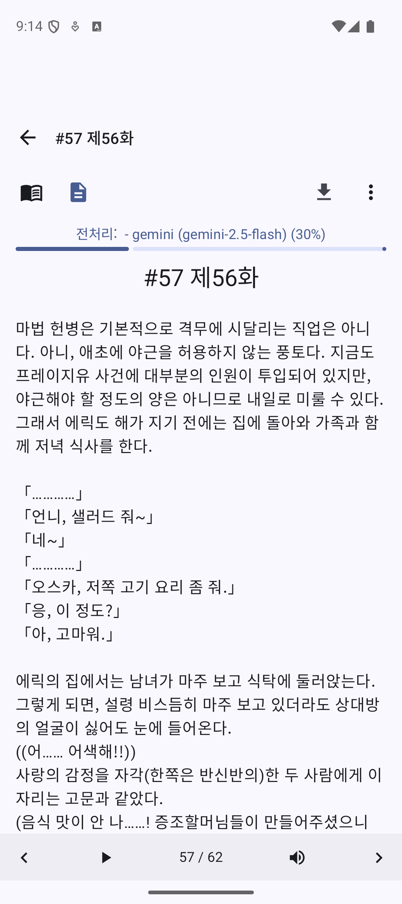

# 번역 기능

Transy의 핵심 기능인 AI 번역 사용법을 안내합니다.

---

## 번역 개요

Transy는 Gemini AI를 활용하여 외국어 소설을 번역합니다.

### 지원 언어

| 원문 | 번역 |
|------|------|
| 일본어 | 한국어 |
| 중국어 (간체/번체) | 한국어 |
| 영어 | 한국어 |
| 기타 | 한국어 |

---

## 자동 번역

회차를 열 때 자동으로 번역이 시작됩니다.

### 설정 방법

1. 설정 > 번역 설정
2. "자동 번역" 토글 ON

### 작동 방식

1. 회차 열기
2. 원문 다운로드 (필요시)
3. 자동으로 번역 시작
4. 번역 완료 후 결과 표시

---

## 수동 번역

자동 번역이 꺼져 있거나, 재번역이 필요할 때 사용합니다.

### 번역 실행

1. 상단 바의 "번역하기" 버튼 클릭
2. 번역 진행 상황 표시 (전처리 → 번역 단계별 진행률)
3. 완료 후 결과 표시

{: width="300" }

---

## 번역 진행 상황

### 표시 정보

```
청크 5/11 (45%)
```

번역이 진행 중일 때:
- 화면 상단에 진행률 바와 퍼센트가 실시간으로 표시됨
- **몰입 모드에서도** 번역 진행도는 항상 화면 최상단에 표시 (반투명 배경)
- 프리패치 아이콘에서도 전체 진행 상태 확인 가능

### 청크란?

긴 텍스트는 여러 청크(덩어리)로 나누어 번역됩니다.
- 각 청크는 개별적으로 API 호출
- 병렬 처리로 속도 향상

---

## 번역 결과 확인

### 번역 완료

번역이 완료되면:
- 번역된 텍스트가 화면에 표시
- 캐릭터 이름 하이라이트
- 원문은 캐시에 보존
- 회차 목록의 번역 완료 배지가 즉시 업데이트됨 (✓ 표시)

### 원문 보기

번역 후에도 원문을 확인할 수 있습니다.

1. 표시 모드 전환 버튼 클릭
2. "원문" 선택
3. 원본 텍스트 표시

---

## 번역 품질 향상

### 컨텍스트 시스템

캐릭터와 용어를 등록하면 번역 품질이 향상됩니다.

- **캐릭터**: 이름 일관성 유지
- **용어**: 고유명사 정확한 번역
- **사건**: 스토리 맥락 반영

> 자세한 내용: [컨텍스트 시스템](../context/overview.md)

### 번역 프롬프트

번역 스타일을 커스터마이징할 수 있습니다.

> 자세한 내용: [번역 프롬프트 커스터마이징](../advanced/translation-prompt.md)

---

## 번역 삭제

번역 결과가 만족스럽지 않으면 삭제하고 재번역할 수 있습니다.

### 삭제 방법

1. 뷰어 메뉴 열기
2. "번역 삭제" 선택
3. 확인 후 삭제

### 삭제 후

- 원문 상태로 돌아감
- 수동으로 재번역 필요
- 컨텍스트 수정 후 재번역 권장

---

## 원문 재다운로드

원문이 손상되었거나 업데이트된 경우:

1. 뷰어 메뉴 열기
2. "원문 재다운로드" 선택
3. 원본 사이트에서 다시 가져옴

> **주의**: 기존 번역도 함께 삭제됩니다.

---

## 번역 캐시

### 캐싱 동작

- 번역 결과는 로컬에 저장됨
- 같은 회차를 다시 열면 캐시된 번역 표시
- API 호출 없이 빠르게 로드

### 캐시 무효화

다음 경우에 캐시가 무효화될 수 있습니다:

- 컨텍스트(캐릭터/용어) 수정 시
- 수동으로 번역 삭제 시
- 원문 재다운로드 시

---

## 번역 설정

### 전역 설정

설정 > 번역 설정에서 조정:

| 설정 | 설명 | 기본값 |
|------|------|--------|
| 자동 번역 | 회차 열 때 자동 실행 | ON |
| 최대 청크 크기 | 한 번에 번역할 텍스트 길이 | 100,000자 |

### 소설별 설정

각 소설마다 다른 번역 설정을 적용할 수 있습니다.

> 자세한 내용: [소설별 설정](../advanced/novel-settings.md)

---

## API 사용량

번역은 API를 사용하므로 비용이 발생할 수 있습니다.

### 비용 확인

설정 > API 사용량 통계에서 확인

### 비용 절감 팁

- 불필요한 재번역 피하기
- 적절한 청크 크기 설정
- 무료 티어가 있는 Gemini 활용

### API 설정 (체인)

하나의 API 설정이 실패하면 자동으로 다른 설정으로 전환됩니다.

```
예시: Gemini 2.5 Flash → Gemini 2.5 Pro → Gemini 2.0 Flash
```

- **장점**: API 할당량 초과나 일시적 오류 시에도 번역 중단 없음
- **설정**: 설정 > API 설정에서 체인 순서 지정

> 자세한 내용: [API 설정](../advanced/fallback-chain.md)

### 콘텐츠 차단 자동 재시도

Gemini API가 콘텐츠를 "금지된 콘텐츠"로 판단하여 차단할 경우:

1. **자동으로 1회 재시도**가 수행됩니다 (동일 설정)
2. 재시도에도 실패하면 **번역이 중단**됩니다 (다른 모델로의 자동 전환은 하지 않음)

> **참고**: 콘텐츠 차단은 API 제공사의 정책에 의한 것으로, 반복 재시도 시 계정에 불이익이 있을 수 있어 1회만 재시도합니다. 지속적으로 차단되는 경우 다른 API 모델을 수동으로 설정하는 것을 권장합니다.

---

## 중국어 소설 번역 품질

### 한자 음역 외계어 방지

중국어 소설 번역 시, AI가 일부 문장을 번역하지 않고 원문을 그대로 남기는 경우가 있습니다. 이런 미번역 문장이 한글로 음역되면 의미를 알 수 없는 "외계어"가 됩니다.

Transy는 이를 자동으로 감지하고 방지합니다:

- **7자 이상 연속 한자**: 미번역 문장으로 판단하여 **원문 한자를 그대로 유지** (무의미한 한글 변환 방지)
- **6자 이하 한자**: 인명, 지명 등으로 판단하여 정상적으로 한글 음역 수행

이 기능은 자동으로 동작하며 별도 설정이 필요 없습니다.

---

## 재번역 활용

### 컨텍스트 수정 후 재번역

캐릭터나 용어 정보를 업데이트한 후 기존 번역을 다시 하고 싶을 때:

1. 캐릭터/용어 컨텍스트에서 정보 수정
2. 해당 회차에서 "번역 삭제" 실행
3. 다시 번역 버튼 클릭

> **팁**: 용어 수정 시 "일괄 치환" 옵션을 사용하면 재번역 없이도 기존 번역에서 해당 용어만 일괄 변경할 수 있습니다.

### 다른 AI 모델로 재번역

번역 품질이 마음에 들지 않을 때 다른 모델로 시도:

1. 소설별 설정에서 번역 API 변경 (예: Gemini 2.5 Flash → Gemini 2.5 Pro)
2. 번역 삭제
3. 재번역 실행

### 번역 프롬프트 수정 후 재번역

번역 스타일을 변경하고 싶을 때:

1. 소설별 설정 > 번역 프롬프트 수정
2. 번역 삭제
3. 재번역으로 새 스타일 적용

---

## 백그라운드 번역과 미리받기

### 통합된 프리패치 시스템

기존의 "백그라운드 번역"과 "미리받기" 기능은 단일 **프리패치(Prefetch)** 시스템으로 통합되었습니다.

### 작동 방식

- 미리받기를 활성화하면 다음 회차들의 원문 다운로드와 번역이 백그라운드에서 자동으로 진행됨
- 별도의 "백그라운드 번역" 메뉴 없이 프리패치 시스템이 모든 자동 번역을 처리
- 뷰어 상단 바의 프리패치 아이콘으로 진행 상황 확인 가능

### 프리패치 시작 방법

1. 소설별 설정에서 "미리받기" 개수 설정 (1-50)
2. 뷰어 상단 바의 프리패치 아이콘 탭
3. 프리패치 시작 버튼 클릭

> 자세한 내용: [미리 받기](prefetch.md)

---

## 문제 해결

### "번역에 실패했습니다"

**원인**:
- API 키 문제
- 할당량 초과
- 네트워크 오류

**해결**:
1. API 키 유효성 확인
2. 할당량 확인
3. 인터넷 연결 확인
4. 잠시 후 재시도

### 번역 품질이 낮음

**해결**:
1. 컨텍스트에 캐릭터/용어 등록
2. 번역 프롬프트 조정
3. 더 높은 품질의 모델 사용 (Gemini 2.5 Pro)

### 번역이 너무 오래 걸림

**해결**:
1. 청크 크기 조정
2. 네트워크 상태 확인
3. 다른 시간대에 시도

### 일부만 번역됨

**원인**:
- API 타임아웃
- 청크 처리 중 오류

**해결**:
1. 번역 삭제 후 재시도
2. API 타임아웃 설정 증가

---

## 관련 항목

- [뷰어 기본 사용법](reader-basic.md) - 뷰어 UI 및 조작법
- [미리 받기](prefetch.md) - 자동 번역 포함 프리패치
- [API 설정 체인](../advanced/fallback-chain.md) - API 실패 시 자동 전환
- [번역 프롬프트](../advanced/translation-prompt.md) - 번역 스타일 커스터마이징
- [컨텍스트 시스템](../context/overview.md) - 번역 품질 향상
- [문제 해결](../troubleshooting/common-issues.md) - 번역 오류 대응
- [핵심 개념](../concepts.md) - 토큰, 청크 등 용어 설명

---

[← 뷰어 기본 사용법](reader-basic.md) | [다음: 미리 받기 →](prefetch.md)
